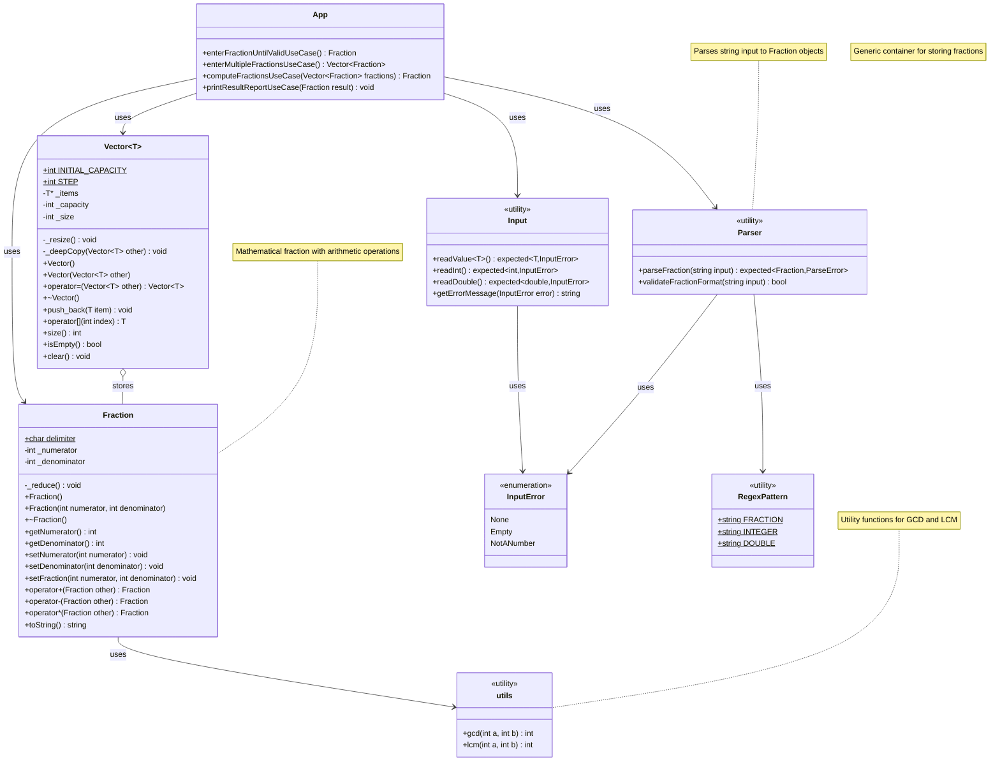

# Fraction Project Class Diagram

```mermaid
classDiagram
    class Fraction {
        +char delimiter$
        -int _numerator
        -int _denominator
        -_reduce() void
        +Fraction()
        +Fraction(int numerator, int denominator)
        +~Fraction()
        +getNumerator() int
        +getDenominator() int
        +setNumerator(int numerator) void
        +setDenominator(int denominator) void
        +setFraction(int numerator, int denominator) void
        +operator+(Fraction other) Fraction
        +operator-(Fraction other) Fraction
        +operator*(Fraction other) Fraction
        +toString() string
    }
    
    class App {
        +enterFractionUntilValidUseCase() Fraction
        +enterMultipleFractionsUseCase() Vector~Fraction~
        +computeFractionsUseCase(Vector~Fraction~ fractions) Fraction
        +printResultReportUseCase(Fraction result) void
    }
    
    class Vector~T~ {
        +int INITIAL_CAPACITY$
        +int STEP$
        -T* _items
        -int _capacity
        -int _size
        -_resize() void
        -_deepCopy(Vector~T~ other) void
        +Vector()
        +Vector(Vector~T~ other)
        +operator=(Vector~T~ other) Vector~T~
        +~Vector()
        +push_back(T item) void
        +operator[](int index) T
        +size() int
        +isEmpty() bool
        +clear() void
    }
    
    class Input {
        <<utility>>
        +readValue~T~() expected~T,InputError~
        +readInt() expected~int,InputError~
        +readDouble() expected~double,InputError~
        +getErrorMessage(InputError error) string
    }
    
    class InputError {
        <<enumeration>>
        None
        Empty
        NotANumber
    }
    
    class Parser {
        <<utility>>
        +parseFraction(string input) expected~Fraction,ParseError~
        +validateFractionFormat(string input) bool
    }
    
    class RegexPattern {
        <<utility>>
        +string FRACTION$
        +string INTEGER$
        +string DOUBLE$
    }
    
    class utils {
        <<utility>>
        +gcd(int a, int b) int
        +lcm(int a, int b) int
    }

    Vector~T~ o-- Fraction : stores
    App --> Fraction : uses
    App --> Vector~T~ : uses
    App --> Input : uses
    App --> Parser : uses
    Parser --> RegexPattern : uses
    Parser --> InputError : uses
    Input --> InputError : uses
    Fraction --> utils : uses

    note for Fraction "Mathematical fraction with arithmetic operations"
    note for Parser "Parses string input to Fraction objects"
    note for utils "Utility functions for GCD and LCM"
    note for Vector~T~ "Generic container for storing fractions"
```