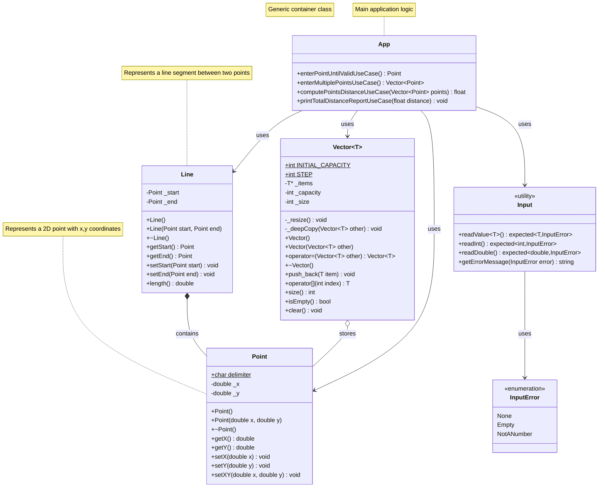

# Point Project Class Diagram

```mermaid
classDiagram
    class Point {
        +char delimiter$
        -double _x
        -double _y
        +Point()
        +Point(double x, double y)
        +~Point()
        +getX() double
        +getY() double
        +setX(double x) void
        +setY(double y) void
        +setXY(double x, double y) void
    }
    
    class Line {
        -Point _start
        -Point _end
        +Line()
        +Line(Point start, Point end)
        +~Line()
        +getStart() Point
        +getEnd() Point
        +setStart(Point start) void
        +setEnd(Point end) void
        +length() double
    }
    
    class Vector~T~ {
        +int INITIAL_CAPACITY$
        +int STEP$
        -T* _items
        -int _capacity
        -int _size
        -_resize() void
        -_deepCopy(Vector~T~ other) void
        +Vector()
        +Vector(Vector~T~ other)
        +operator=(Vector~T~ other) Vector~T~
        +~Vector()
        +push_back(T item) void
        +operator[](int index) T
        +size() int
        +isEmpty() bool
        +clear() void
    }
    
    class App {
        +enterPointUntilValidUseCase() Point
        +enterMultiplePointsUseCase() Vector~Point~
        +computePointsDistanceUseCase(Vector~Point~ points) float
        +printTotalDistanceReportUseCase(float distance) void
    }
    
    class Input {
        <<utility>>
        +readValue~T~() expected~T,InputError~
        +readInt() expected~int,InputError~
        +readDouble() expected~double,InputError~
        +getErrorMessage(InputError error) string
    }
    
    class InputError {
        <<enumeration>>
        None
        Empty
        NotANumber
    }

    Line *-- Point : contains
    Vector~T~ o-- Point : stores
    App --> Point : uses
    App --> Vector~T~ : uses
    App --> Line : uses
    App --> Input : uses
    Input --> InputError : uses

    note for Point "Represents a 2D point with x,y coordinates"
    note for Line "Represents a line segment between two points"
    note for Vector~T~ "Generic container class"
    note for App "Main application logic"
```